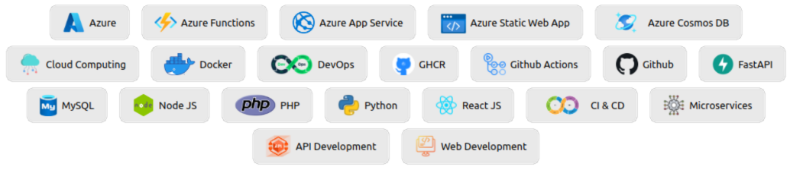
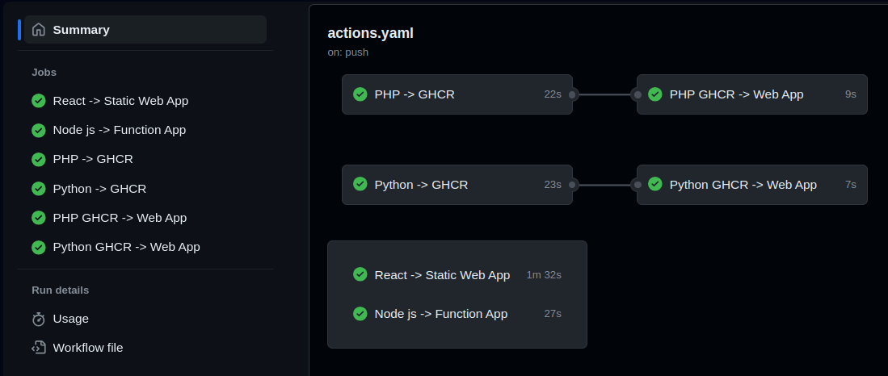

# Tools and Technologies



# Table of Contents

- [Tools and Technologies](#tools-and-technologies)
- [Table of Contents](#table-of-contents)
- [Project](#project)
	- [Contact Microservice: Node JS on Azure Functions](#contact-microservice-node-js-on-azure-functions)
		- [Project Structure](#project-structure)
		- [Deployment](#deployment)
	- [Data Microservice: Python FastAPI on Azure Web App (App Service)](#data-microservice-python-fastapi-on-azure-web-app-app-service)
		- [Project Structure](#project-structure-1)
		- [Deployment](#deployment-1)
	- [Auth Microservice: PHP on Azure Web App (App Service)](#auth-microservice-php-on-azure-web-app-app-service)
		- [Project Structure](#project-structure-2)
		- [Deployment](#deployment-2)
	- [React on Azure Static Web App (App Service)](#react-on-azure-static-web-app-app-service)
		- [Project Structure](#project-structure-3)
		- [Deployment](#deployment-3)
- [Github Workflows](#github-workflows)


# Project

The project involves 3 microservices and a website

|   Name   |           Location           |        Description         | Language |      Database       |          Deployment          |
|:--------:|:---------------------------:|:---------------------------:|:--------:|:---------------------:|:-----------------------------:|
| Contact  |  microservices/contact      |  Saves user email and message| Node.js  | Azure Cosmos Database | Azure Functions App           |
| Auth     |  microservices/auth         |  User login and signup       | PHP      | Azure MySQL Database   | Azure Web App - App Service   |
| Data     |  microservices/data         |  Data for different colleges | Python   | Azure MySQL Database   | Azure Web App - App Service   |
| Website  |  website                    |  Front-end                   | React    |                       | Azure Static Web App - App Service |


## Contact Microservice: Node JS on Azure Functions

- It is a [Node JS](https://nodejs.org/en) based serverless microservice that is hosted on [Azure Function App](https://learn.microsoft.com/en-us/azure/azure-functions/functions-overview) and is triggered on http request.
- Is takes email and message as input and saves it in [Azure Cosmos Database](https://learn.microsoft.com/en-us/azure/cosmos-db/introduction)

### Project Structure
```
microservices/contact
└── contact-function
    ├── function.json
    └── index.js
```

### Deployment
Github workflow configuration for continuous deployment
```yaml
  build-and-deploy:
    runs-on: ubuntu-latest # Use ubuntu-latest for Linux
    name: Node js -> Function App
    steps:
      - uses: actions/checkout@v4

      - name: 'Run Azure Functions Action'
        uses: Azure/functions-action@v1
        id: fa
        with:
          app-name: unifinder-function
          package: microservices/contact
          publish-profile: ${{ secrets.AZURE_FUNCTION_APP_UNIFINDER_CONTACT_PUBLISH_PROFILE }}

```

## Data Microservice: Python FastAPI on Azure Web App (App Service)

- [Python FastAPI]() based microservice that connects with [Azure MySQL Database]()
- This API is used by the website to show dynamic data

### Project Structure
```
microservices/data
├── db_config.py
├── db.py
├── Dockerfile
├── main.py
└── requirements.txt
```

### Deployment

The deployment involves the following steps
- Build Docker image from Dockerfile in the project
- Push this docker images on github container registry
- Pass the pushed image to Azure App service that pulls and runs the container

```yaml
  data-build-to-ghcr:
    runs-on: ubuntu-latest
    name: Python -> GHCR
    steps:
      - uses: actions/checkout@v4

      - name: Login to GitHub Container Registry
        run: echo "${{ secrets.TOKEN }}" | docker login ghcr.io -u ${{ github.actor }} --password-stdin

      - name: unifinder-data
        run: |
          docker build -t ghcr.io/geetu040/unifinder-data microservices/data/
          docker push ghcr.io/geetu040/unifinder-data

  data-deploy-to-appservice:
    runs-on: ubuntu-latest
    needs: data-build-to-ghcr
    name: Python GHCR -> Web App
    steps:
      - uses: actions/checkout@v4

      - name: Deploy to Azure Web App
        uses: azure/webapps-deploy@v2
        id: deploy-to-data
        with:
          app-name: unifinder-data
          publish-profile: ${{ secrets.AZURE_APP_SERVICE_WEB_APP_UNIFINDER_DATA_PUBLISH_PROFILE }}
          images: ghcr.io/geetu040/unifinder-data

```


## Auth Microservice: PHP on Azure Web App (App Service)
- [PHP]() Based Authentication Service that is deployed as a docker container on [Azure App Service]()
- It can be used by the website for user authentication

### Project Structure
```
microservices/auth
├── connect.php
├── Dockerfile
├── index.php
├── login.php
└── register.php
```

### Deployment

The deployment involves the following steps
- Build Docker image from Dockerfile in the project
- Push this docker images on github container registry
- Pass the pushed image to Azure App service that pulls and runs the container

```yaml
  auth-build-to-ghcr:
    runs-on: ubuntu-latest
    name: PHP -> GHCR
    steps:
      - uses: actions/checkout@v4

      - name: Login to GitHub Container Registry
        run: echo "${{ secrets.TOKEN }}" | docker login ghcr.io -u ${{ github.actor }} --password-stdin

      - name: unifinder-auth
        run: |
          docker build -t ghcr.io/geetu040/unifinder-auth microservices/auth/
          docker push ghcr.io/geetu040/unifinder-auth
  auth-deploy-to-appservice:
    runs-on: ubuntu-latest
    name: PHP GHCR -> Web App
    needs: auth-build-to-ghcr
    steps:
      - uses: actions/checkout@v4

      - name: Deploy to Azure Web App
        uses: azure/webapps-deploy@v2
        id: deploy-to-auth
        with:
          app-name: unifinder-auth
          publish-profile: ${{ secrets.AZURE_APP_SERVICE_WEB_APP_UNIFINDER_AUTH_PUBLISH_PROFILE }}
          images: ghcr.io/geetu040/unifinder-auth
```

## React on Azure Static Web App (App Service)

### Project Structure
Basic React App for deployment and continuos integration testing
```
website
├── package.json
├── package-lock.json
├── public
│   ├── favicon.ico
│   ├── index.html
│   ├── logo192.png
│   ├── logo512.png
│   ├── manifest.json
│   └── robots.txt
├── README.md
└── src
    ├── App.css
    ├── App.js
    ├── App.test.js
    ├── index.css
    ├── index.js
    ├── logo.svg
    ├── reportWebVitals.js
    └── setupTests.js
```

### Deployment

```yaml
  react-to-staticwebapp:
    runs-on: ubuntu-latest
    name: React -> Static Web App
    steps:
      - uses: actions/checkout@v4

      - name: Build And Deploy
        uses: Azure/static-web-apps-deploy@v1
        with:
          azure_static_web_apps_api_token: ${{ secrets.AZURE_APP_SERVICE_STATIC_WEB_APP_UNIFINDER_WEBSITE_TOKEN }}
          action: "upload"
          app_location: "website"
          output_location: "build"
```

# Github Workflows

Github Actions and Workflows have been used for continuous integration and deployment. Following are the deployment results:

